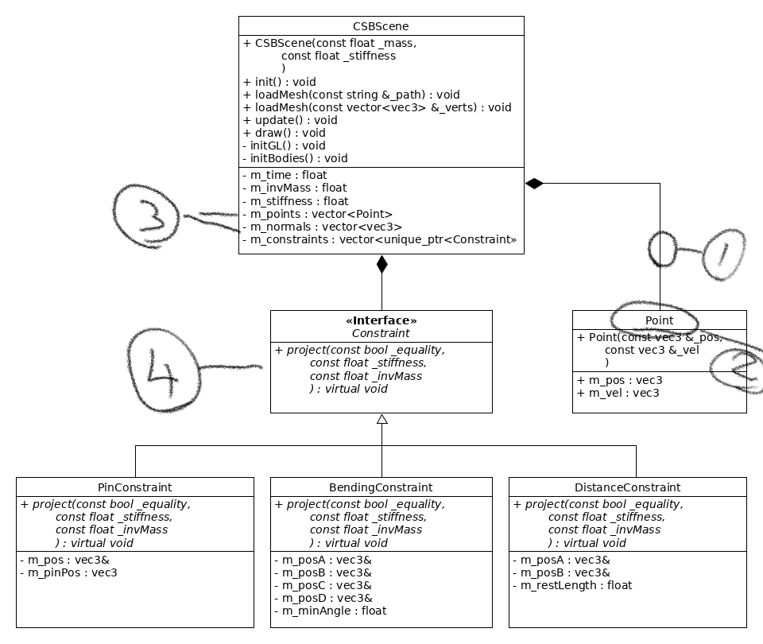

# Assignment Feedback

## General Feedback

In general, a lot of the class diagrams are not showing the attributes properly, you should re-visit your classes now and see if you can actually write code for them/

Follow the guidelines [here](http://jonmacey.blogspot.co.uk/2013/01/ca-1-initial-design-general-feedback.html) for more information as well as [this](http://jonmacey.blogspot.co.uk/2011/01/asd-ca1-assignment-feedback-and.html)

Your main program loop can also be written very quickly to test it, use print statements and dummy classes to make sure you can effectively wire-up your different classes and let them interact, again this can be done with just print outs and no graphical elements, this will make any errors / design flaws apparent very quickly. Best way to do this is to read the [following](http://jonmacey.blogspot.co.uk/2012/02/getting-started-with-programming.html) posts

## Specific Feedback

A good design report outlining what you are going to do with good detail.

I would suggest using the ```ngl::Obj``` class as you initial method of loading the meshes as you have access to all the data you need (Faces, Verts, UV's and Normals)

I would use RK4 over Euler (or perhaps verlet) as it will be more accurate, You will also need to timer to allow for the integration steps. 

Have you considered using [Position Based Dynamics](http://matthias-mueller-fischer.ch/publications/posBasedDyn.pdf) instead? There was a good masters project [here](https://nccastaff.bournemouth.ac.uk/jmacey/MastersProjects/MSc15/03Pieterjan/index.html)

## Class Diagram



1. Need to show the multiplicity of the relationships between the classes.
2. Point is not a good name for this class (make me think of 2D or 3D point) but this is more as it has velocity, it could also be a struct not a class.
3. points and normals are part of the scene. I think you need an inbetween object (Mesh) to store this data, or at least process you simulation data and produce one. You normals will need to be calculated each frame (and what about UV for textures).
4. This is good, but could be be extensible to add new constraint types, do these even need to be part of the system but actually just link to the main Point class.

I think this would work better using the Position Based system.